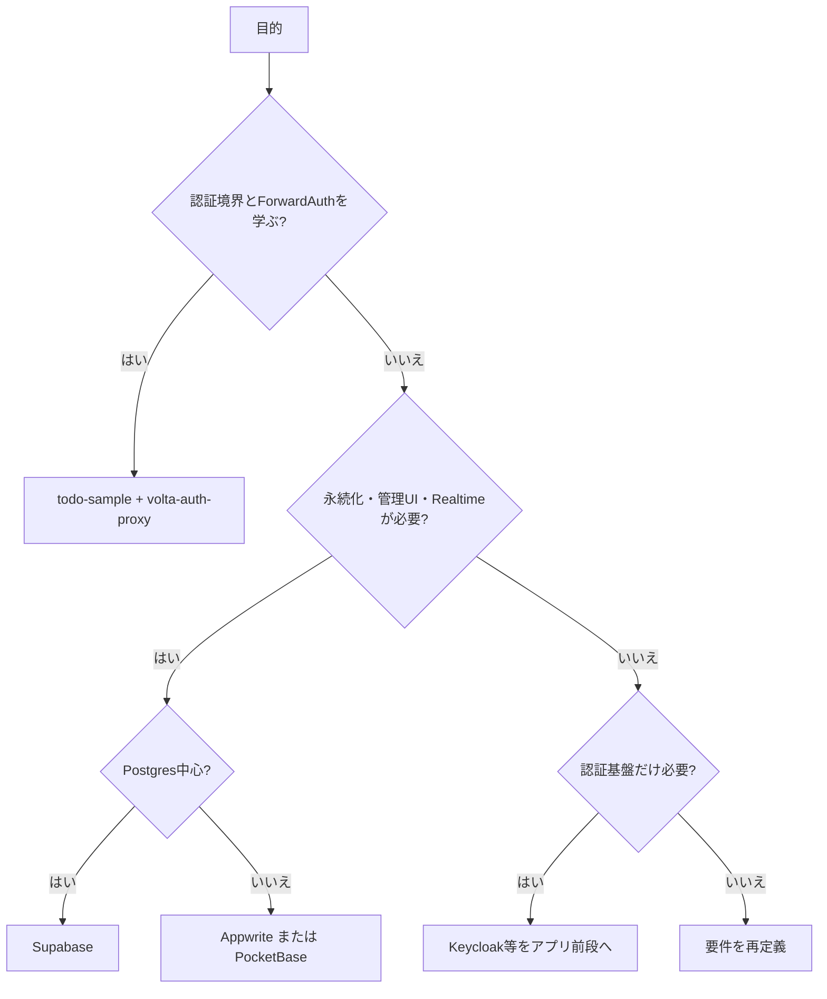

# 市場調査: todo-sample

## 0. 要約

立ち位置: `todo-sample` は製品競争ではなく、volta-auth-proxy と組み合わせて「認証は前段、テナント分離はアプリ」という境界を教える最小リファレンスである。

最大の弱点: 永続化・実認証・テスト・運用機能がなく、Supabase／Appwrite／PocketBaseなら実アプリの土台まで一度に置き換えられる。

次の一手: Todo機能を増やすのではなく、信頼するヘッダの前提を検証できるテストと、認証境界を実際に触れる再現可能なデモ環境を先に作る。

## 1. このrepoは何か

一言でいえば、Java 17・Jakarta Servlet 5・Mavenだけで動く、tenant×user分離のインメモリTodo APIと、その認証境界を学ぶハンズオンである。`TodoServlet` は `X-Volta-Tenant-Id` と `X-Volta-User-Id` を読み、`TodoStore` はその組をキーにTodoを分離する。ヘッダがない場合は `public` / `anonymous` にフォールバックする。

価値はTodoのCRUDそのものではない。前段の `volta-auth-proxy` が認証してヘッダを付け、アプリ側は認証実装を持たず、認可・業務ロジックを担当するという構成を、最小コードで読んで試せることにある。したがって比較単位は「JavaのTodoライブラリ」ではなく、認証・ユーザ／テナント分離を含むアプリの学習・試作体験である。

想定利用者は、ForwardAuthと信頼境界、RBAC、SSE/Webhookなどを段階的に学ぶ開発者である。READMEと `handson/` には18個のMarkdown教材があり、ロードマップにはSSE、Webhook、招待、監査ログが記載されている。

確認できた客観指標は、Java 4ファイル・348 LOC、直接依存1件、公開メソッド5件、`mvn test` 成功（テストケースは0）である。永続化はなく、プロセス再起動でデータが消え、複数インスタンス間でも共有されない。

## 1.5 調査の型

`internal` と判定した。公開市場向けのサービスや汎用ライブラリではなく、volta-auth-proxyを前提にした自家用の学習・検証基盤だからである。問いは「どう製品として勝つか」ではなく、「既製のBackend/Authを使わずに、この小ささと教材価値を保つ理由があるか」である。

## 2. 比較対象と選定理由

| 製品 | 何ができるか | 採用状況（2026-07-31参照） | ライセンス | うちとの決定的な違い | なぜ比較対象に選んだか |
|---|---|---|---|---|---|
| ZenStack Todo Sample | SvelteKitの共同Todo、workspace招待、データ分離、権限制御 | ★14 / 118 commits、リリースなし | リポジトリ表示では要確認 | 同じTodo教材だが、DB・サインイン・workspace UIまで含む | もっとも近い「学習用Todo＋権限」の実例 |
| Supabase | Postgres、Auth、REST/GraphQL、Realtime、Functions、Storage | ★104k / 最新表示 Developer Update 2026-05-07 | Apache-2.0 | データ・認証・API・運用をまとめて提供 | Todo APIを作らずに同じ業務機能へ到達できる代表的BaaS |
| Appwrite | Auth、Databases、Storage、Functions、Messaging、Hosting、Realtime | ★56.2k / 1.9.0 2026-04-01 | BSD-3-Clause | 完成したBackend基盤で、管理UIと多数のSDKを持つ | Supabaseとは異なる自己ホスト型BaaSの有力候補 |
| PocketBase | SQLite組み込み、ユーザ管理、REST-ish API、管理UI、Realtime | ★58.6k / v0.38.2 2026-05-22 | MIT | 1ファイルに近い手軽さを保ちつつ永続化と管理UIがある | 「小さく始める」要求で最も直接的な代替候補 |
| Keycloak | OIDC/SAML、ユーザ・ロール、Identity Brokering、認証・認可 | ★34.9k / 26.6.3 2026-06-04 | Apache-2.0 | Todoやデータ層は持たず、認証基盤だけを置き換える | volta-auth-proxyの前段という責務を比較するため |

この地図は、学習用サンプルと、実運用のBackend-as-a-Service、認証専用基盤が混在する市場である。市場の主流は「機能を足してアプリを完成させる」方向で、最小の認証境界を読むこと自体を価値にするrepoは少ない。ZenStackは近いが、DBとUIを含むため、`todo-sample` の小ささとは交換条件がある。

なお、KeycloakはTodoの置換ではない。認証だけを既製品に寄せ、アプリ側のデータ分離を残す場合の比較対象として扱う。

## 4. 機能比較

凡例: ○=ある / △=部分的・要設定 / ×=ない。重み: ◎=この立ち位置で必須 / ○=効く / △=あれば良い / —=不要。

| 機能 | 重み | todo-sample | ZenStack Todo | Supabase | Appwrite | PocketBase | Keycloak |
|---|---|---|---|---|---|---|---|
| 認証をアプリ外へ分離 | ◎ | ○ | × | △ | △ | △ | ○ |
| tenant×userのデータ分離をコードで読める | ◎ | ○ | △ | △ | △ | △ | × |
| Todo CRUD | ○ | ○ | ○ | ○ | ○ | ○ | × |
| 永続化 | ○ | × | ○ | ○ | ○ | ○ | — |
| 実運用の認証・セッション・MFA | ○ | × | △ | ○ | ○ | ○ | ○ |
| workspace／招待／権限UI | ○ | × | ○ | △ | ○ | △ | △ |
| Realtime | △ | × | × | ○ | ○ | ○ | × |
| 依存を読んで理解できる小ささ | ◎ | ○ | × | × | × | △ | × |
| 認証境界を段階的に学ぶ教材 | ◎ | ○ | △ | × | × | × | × |

痛い×は永続化と実認証である。ただし、これらは本repoの教材目的に対しては「不足」ではなく、意図的に外へ出している責務でもある。逆にTodo CRUDは全対象が持つため差別化にならない。勝負所は機能数ではなく、認証ヘッダを誰が発行し、アプリが何を信用してよいかを短いコードで検証できる点である。

## 4.5 コード・実装の比較

本repoはコードを読んで計測し、比較対象は公開リポジトリのREADME・構成・マニフェストまで確認した。比較対象のテスト実行や全ソースのLOC計測は、この環境では実施できていないため、未確認を数字で埋めない。

| 観点 | todo-sample | ZenStack Todo | Supabase | Appwrite | PocketBase | Keycloak | 出典 |
|---|---:|---:|---:|---:|---:|---:|---|
| Java/主要コードの規模 | 4 Java / 348 LOC | TypeScript 74.2%、Svelte 24.6% | TypeScript 69.2% | PHP中心（全体LOC未確認） | Go中心（全体LOC未確認） | Java 91.8% | 各リポジトリ表示、repo内計測 |
| 直接依存 | 1件 | package-lockあり（件数未確認） | pnpm workspace（件数未確認） | composer/package lockあり（件数未確認） | go.modの直接require 20件 | 多モジュールMaven（件数未確認） | 各マニフェスト／本repo `pom.xml` |
| テスト | `mvn test` 成功、0 tests | 未実行 | 未実行 | 未実行 | 未実行 | 未実行 | 2026-07-31の実行記録 |
| 永続化方式 | なし、ConcurrentHashMap | PostgreSQL | PostgreSQL | DBを含むBackend | SQLite組み込み | DBが必要 | 各README・構成 |
| ライセンス制約 | pomに明記なし（要確認） | 要確認 | Apache-2.0 | BSD-3-Clause | MIT | Apache-2.0 | LICENSE／GitHub表示 |

実装前提は大きく異なる。`todo-sample` は依存と状態を極小化し、認証を一行のヘッダ読取まで押し出す。一方、代替製品は永続化、セッション、管理API、SDK、運用をコード量と引き換えに持つ。したがって「小さいから高品質」とは言えず、目的が教材なら小ささが効き、製品化なら未実装部分がリスクになる。

## 5.5 調査者の見立て

本当の勝負所は、Todoの機能差ではなく「認証と認可の責務分離を、private networkと信頼ヘッダの前提まで含めて学べること」だと読める。ここはBaaSの機能表では代替しにくい。

数字に出ていない懸念は、現状のテスト0件だと、ヘッダ偽装・空白フォールバック・tenant越境を教材として安全に保証できないことだ。小さい実装ほど、この境界の一箇所の誤りが全教材に波及する。

自分なら、Todoの高度化ではなく、認証境界のテスト、Dockerでのproxy→app実演、そして「直接appへ到達できると安全ではない」という失敗例を先に足す。Keycloak連携は後でよく、volta固有の学習価値を薄めない。

この見立てが外れる条件は、利用者が教材ではなく本番用のマルチテナントTodoを求めている場合である。その場合は、永続化・監査・運用を持つBaaSまたは認証基盤＋DBへ移行する方が合理的で、現状repoを拡張し続ける判断は成立しない。

## 6. 提案（優先順）

| 順 | 提案 | 分類 | 根拠 | 最小の一手 | 効きそうな指標 |
|---:|---|---|---|---|---|
| 1 | ヘッダ信頼モデルの自動テストを追加する | 伸ばす | ◎の認証境界だがテスト0件 | Servletのリクエストテストで、tenant/user分離、未設定フォールバック、ID不正、直接アクセス前提を固定 | tenant越境テスト0件、教材手順の再現成功率 |
| 2 | proxy→todo-sampleを一発起動できるcomposeと攻撃／正常curl例を教材化する | 伸ばす | READMEはproxy前提だが、直接到達時の危険が運用前提に依存 | proxy、app、network境界を含む最小composeを作り、ヘッダ偽装が通る／通らない差を示す | 初回起動時間、認証境界を説明できる受講者割合 |
| 3 | 永続化は本体に入れず、`TodoStore`差し替え契約とSQLite lessonを用意する | 埋める | 本番化の最大の×だが、依存ゼロという教材価値も守る必要がある | interface化せず、まずSQLite実装を別lessonとして並置し、再起動保持だけ検証 | 再起動後のデータ保持、依存追加数 |
| 4 | volta固有のRBAC/Webhook/audit lessonを完成させる | 伸ばす | BaaSとの差別化は認証境界と連携学習にある | 既存roadmapのRBACを実動作にし、HMAC webhookの最小例を追加 | lesson完走率、proxy→appイベントの再現率 |
| 5 | Supabase/Appwrite/PocketBaseの機能をTodo本体へ取り込まない | やらない | CRUD、管理UI、Realtimeを足すとBaaSとの機能競争になり、最小リファレンスの差別化を失う | READMEに非目標として明記し、必要な人には比較表から移行先を示す | Java LOC、直接依存数、教材の最初の理解時間 |

## 7. 選択の分岐

## 8. 出典

| URL | 参照日 | 何の根拠に使ったか |
|---|---|---|
| [本repo README](../../README.md) | 2026-07-31 | 目的、API、volta-auth-proxy連携、制約、ハンズオン構成 |
| [本repo TodoServlet](../../src/main/java/todo/TodoServlet.java) | 2026-07-31 | ヘッダ読取、フォールバック、API、64 KiB制限 |
| [本repo TodoStore](../../src/main/java/todo/TodoStore.java) | 2026-07-31 | tenant×userキー、インメモリ実装 |
| [本repo pom.xml](../../pom.xml) | 2026-07-31 | Java 17、Jakarta Servlet、直接依存、Jetty |
| [ZenStack Todo Sample](https://github.com/zenstackhq/sample-todo-sveltekit) | 2026-07-31 | 共同Todo、signup/signin、workspace招待、分離・権限、14 stars、ライセンス表示不明 |
| [Supabase repository](https://github.com/supabase/supabase) | 2026-07-31 | 104k stars、Apache-2.0、Postgres/Auth/API/Realtime/Functions/Storage、2026-05-07表示の更新 |
| [Appwrite repository](https://github.com/appwrite/appwrite) | 2026-07-31 | 56.2k stars、BSD-3-Clause、Auth/Databases/Storage/Functions/Hosting/Realtime |
| [Appwrite 1.9.0 release](https://github.com/appwrite/appwrite/releases/tag/1.9.0) | 2026-07-31 | 最新リリース日 2026-04-01、Webhook、Realtime、Auth、DB機能の追加 |
| [PocketBase repository](https://github.com/pocketbase/pocketbase) | 2026-07-31 | 58.6k stars、MIT、SQLite、ユーザ管理、REST-ish API、管理UI、Realtime |
| [PocketBase go.mod](https://raw.githubusercontent.com/pocketbase/pocketbase/master/go.mod) | 2026-07-31 | Go 1.25、直接require数20件（公開マニフェストを確認） |
| [Keycloak repository](https://github.com/keycloak/keycloak) | 2026-07-31 | 34.9k stars、Apache-2.0、Java 91.8%、OIDC/SAML系の認証基盤 |
| [Keycloak 26.6.3 release](https://github.com/keycloak/keycloak/releases/tag/26.6.3) | 2026-07-31 | 最新リリース日 2026-06-04 |
| [本repo `mvn test` 実行](../../pom.xml) | 2026-07-31 | 終了コード0、テストケース0。実行環境での確認記録 |
