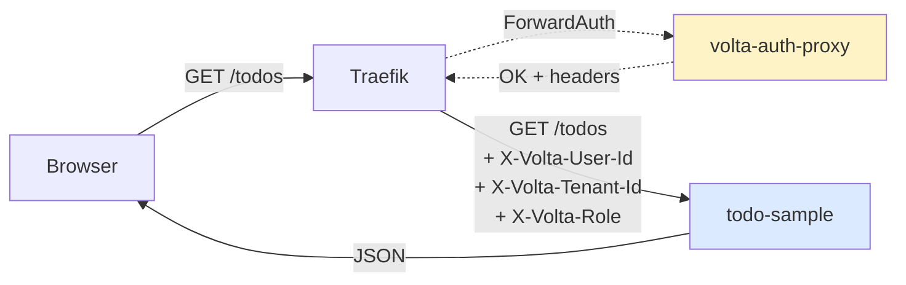
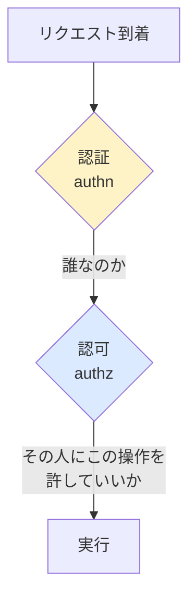
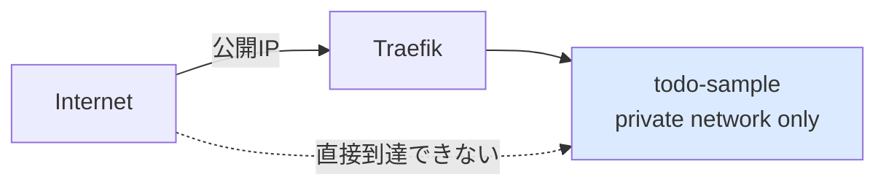

# 00 — Overview: volta-auth-proxy って何?

## 対話

> **後輩**「この todo-sample、認証なしで動きますよね? なんで volta-auth-proxy 要るんです?」

> **先輩**「アプリの中で `if (loggedIn)` 書きたくないからだ。認証は **アプリの外** に追い出す。」

> **後輩**「外って、どこにです?」

> **先輩**「**前段の proxy**。ブラウザからのリクエストは proxy が先に受けて、認証通ったらヘッダを付けてアプリに流す。アプリは そのヘッダだけ読めばいい。」

## 全体図

ポイント:
- **アプリに認証コードは無い**。proxy が認証して、結果をヘッダで渡してくる
- アプリは **ヘッダを信用するだけ**(直接ブラウザから来た怪しいリクエストは proxy が弾いてる前提)
- 認証(誰?)は proxy、**認可(何ができる?)はアプリ**。これは分離する

## 渡ってくるヘッダ

| ヘッダ | 中身 | 例 |
|---|---|---|
| `X-Volta-User-Id` | 認証済みユーザID | `usr_abc123` |
| `X-Volta-Tenant-Id` | 所属テナントID | `tnt_456` |
| `X-Volta-Role` | テナント内のロール | `MEMBER` / `ADMIN` / `OWNER` |

これだけ。**たった3つ**。

## 認証 vs 認可

> **後輩**「認証と認可って何が違うんですか?」

> **先輩**「authentication = 誰? / authorization = 何していい?」

- **認証** = volta-auth-proxy の仕事(OIDC/SAML/Passkey/MFA…全部やってくれる)
- **認可** = アプリの仕事(`role == ADMIN` なら削除OK、みたいなビジネスルール)

> **後輩**「全部 proxy がやってくれたら楽そう」

> **先輩**「認可までやらせると、アプリの business logic を proxy 側に吸い込むことになる。**認可の主導権はアプリが持つ**。これは ADR 級の判断だ。」

## ヘッダ信頼モデル

> **後輩**「ヘッダなんて簡単に偽装できますよね? `curl -H "X-Volta-User-Id: admin"` とか」

> **先輩**「**直接アプリを叩かれたら危ない**。本番では:」

- Traefik(または proxy)を **唯一の入口** にする
- todo-sample は **private network からしか到達できない** ようにデプロイする
- proxy が必ず通る = ヘッダは proxy が付けたものだけ
- ローカル開発では `curl -H "X-Volta-User-Id: alice"` で proxy のフリができる(=これが hands-on で使う方法)

## 次の lesson

[01-volta-headers](../01-volta-headers/) — `user="anonymous"` を **本物のヘッダから読む** ように書き換える。
