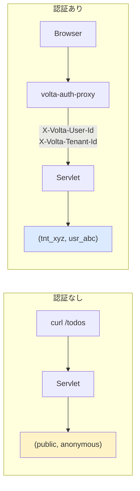

# 01 — volta-headers: user/tenant をヘッダから識別する

## 対話

> **後輩**「現状の todo-sample って、誰が来ても全部 anonymous 扱いですよね?」

> **先輩**「そう。`TodoServlet#service` の頭が:」

```java
String tenant = "public";
String user = "anonymous";
```

> **先輩**「ハードコード。これが volta-auth-proxy 経由になると `X-Volta-Tenant-Id` と `X-Volta-User-Id` が降ってくる。書き換えるだけ。」

> **後輩**「ヘッダ無かったら?」

> **先輩**「proxy 通ってないってこと。**直接アプリを叩かれた**か、ローカル開発か。今回は anonymous フォールバックを残す(2ch+名無し的に動く)。本番では proxy 必須にして、ヘッダ無しは 401 にすべき。」

## 概念



**ストア側は無変更**。`(tenant, user)` をキーにしてあるので、値が `(public, anonymous)` でも `(tnt_xyz, usr_abc)` でも同じコードで動く。これが Plan A の利点。

## 課題

[問題](問題/) を読んで、自分で `TodoServlet.java` を書き換える。

## 答え合わせ

書き終わったら [答え](答え/) で答え合わせ。

## 検証ヒント

```bash
# anonymous フォールバック(volta なしの状態)
curl -d '{"title":"public/anonymous"}' -H "Content-Type: application/json" \
     http://localhost:7743/todos

# proxy のフリ(本物の volta が前段にいる想定)
curl -d '{"title":"alice in tnt_a"}' \
     -H "Content-Type: application/json" \
     -H "X-Volta-User-Id: alice" \
     -H "X-Volta-Tenant-Id: tnt_a" \
     http://localhost:7743/todos

# alice の todo は同じテナントにいる alice にしか見えない
curl -H "X-Volta-User-Id: alice" -H "X-Volta-Tenant-Id: tnt_a" \
     http://localhost:7743/todos

# bob には見えない
curl -H "X-Volta-User-Id: bob" -H "X-Volta-Tenant-Id: tnt_a" \
     http://localhost:7743/todos     # → []

# 別テナントの alice にも見えない
curl -H "X-Volta-User-Id: alice" -H "X-Volta-Tenant-Id: tnt_b" \
     http://localhost:7743/todos     # → []
```
