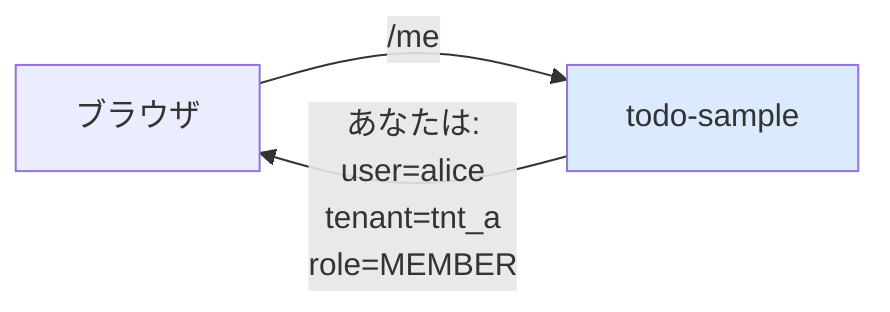

# 02 — whoami: 受け取った値を露出する

## 対話

> **後輩**「ヘッダ読めるようになったけど、アプリ側で何が見えてるか確認したいんですけど」

> **先輩**「`/me` エンドポイント生やすのが定番。proxy が何渡してきてるかを JSON で返すだけ。」

> **後輩**「セキュリティ的に大丈夫? 自分の情報晒してるだけだから OK?」

> **先輩**「そう。`/me` は **その人自身の情報を返す** だけだから晒してOK。他人の情報は返さないこと。」

## なぜ作るか



- **デバッグ**: proxy 設定が正しいか即確認できる
- **UI**: ヘッダ画面に「ようこそ alice さん」と出すデータ源
- **学習**: 認証層から何が降ってくるかを **コードで触れる形** で見せられる

実運用でも `/me` や `/whoami` は標準的なパターン(GitHub API の `GET /user`、Slack API の `users.identity` 等)。

## 課題

[問題](問題/) を読んで `/me` を実装する。

## 答え合わせ

[答え](答え/) で答え合わせ。

## 検証イメージ

```bash
curl http://localhost:7743/me
# → {"user":"anonymous","tenant":"public","role":null,"authenticated":false}

curl -H "X-Volta-User-Id: alice" -H "X-Volta-Tenant-Id: tnt_a" -H "X-Volta-Role: MEMBER" \
     http://localhost:7743/me
# → {"user":"alice","tenant":"tnt_a","role":"MEMBER","authenticated":true}
```
