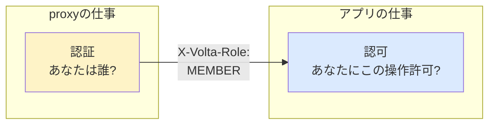

# 03 — RBAC: X-Volta-Role で認可を分ける

## 対話

> **後輩**「テナント内で **誰でも他人の todo 消せたら困る** と思うんですが」

> **先輩**「気づいたか。今まで `(tenant, user)` で分離してたから他人の todo は **見えない** が、role の概念がないので `OWNER` も `MEMBER` も同権限だ。」

> **後輩**「volta-auth-proxy が `X-Volta-Role` 渡してくるんですよね? 使えば?」

> **先輩**「そう。`OWNER` / `ADMIN` / `MEMBER` の3階層。テナント管理者だけが他のメンバの todo を消せる、みたいなビジネスルールはアプリ側で書く。」

## 認証 vs 認可(再掲)



ロール **値** は proxy が決める(誰が ADMIN かは proxy 側のテナント管理機能)。
ロール **解釈** はアプリが決める(ADMIN は何ができるか、はビジネスルール)。

> **後輩**「これ、proxy にロール解釈させたら駄目なんですか?」

> **先輩**「やれば動くが、**proxy が業務知識を持つ**ことになる。todo-sample では「他人の todo を ADMIN だけ消せる」、別アプリでは「ADMIN だけ payment できる」とか、各アプリの認可ルールは proxy にとって雑音だ。」

## 今回のロール設計

| Role | 自分の todo | 他人の todo |
|---|---|---|
| `OWNER` | 全部できる | 全部できる |
| `ADMIN` | 全部できる | 全部できる |
| `MEMBER` | 全部できる | 触れない |
| (anonymous, role=null) | 自分の(=anonymous の)todo は触れる | 触れない |

> **後輩**「`OWNER` と `ADMIN` 一緒で良くないですか?」

> **先輩**「volta では `OWNER` = テナント所有者 = 課金責任者、`ADMIN` = テナント運営者という区別をしてる。todo-sample レベルでは同じ扱いで OK。設計上分けてあるだけ。」

## 課題

[問題](問題/) を読んで RBAC を実装する。

## 答え合わせ

[答え](答え/) で答え合わせ。

## 検証イメージ

```bash
# alice@tnt_a が todo 作る
curl -d '{"title":"alice の作業"}' -H "Content-Type: application/json" \
     -H "X-Volta-User-Id: alice" -H "X-Volta-Tenant-Id: tnt_a" -H "X-Volta-Role: MEMBER" \
     http://localhost:7743/todos
# → id=1

# bob@tnt_a (MEMBER) が alice の todo を消そうとする
curl -X DELETE -H "X-Volta-User-Id: bob" -H "X-Volta-Tenant-Id: tnt_a" -H "X-Volta-Role: MEMBER" \
     http://localhost:7743/todos/1
# → 403 forbidden

# carol@tnt_a (ADMIN) なら消せる
curl -X DELETE -H "X-Volta-User-Id: carol" -H "X-Volta-Tenant-Id: tnt_a" -H "X-Volta-Role: ADMIN" \
     http://localhost:7743/todos/1
# → 204
```
