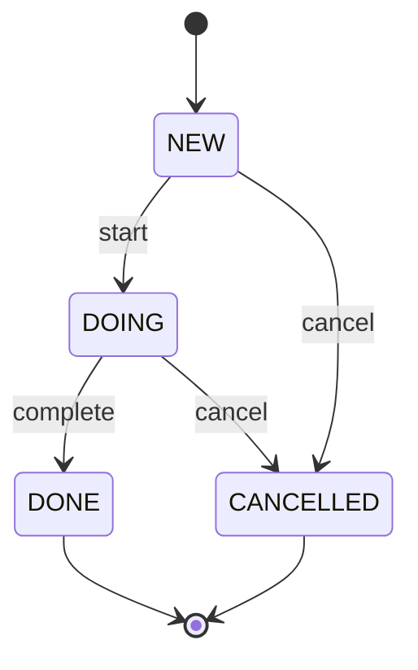

# 04 — tramli basics: 制約付き state machine

## 対話

> **後輩**「lesson 05 で auth-viz やる前置きとして tramli を学ぶって言ってましたけど、そもそも何ですか?」

> **先輩**「**状態機械を declarative に書くと、不正な遷移がコンパイル時に弾ける**ライブラリ。volta-auth-proxy が auth flow の定義に使ってる。」

> **後輩**「ふつうの enum + switch じゃダメ?」

> **先輩**「動くが、`CANCELLED` から `IN_PROGRESS` に遷移しちゃう、みたいなバグが書ける。tramli は『どの state からどの state へ』を **遷移表で宣言** して、そこに無い遷移はそもそも実行できない。」

## tramli の世界観

```mermaid
flowchart LR
    subgraph 普通のenum+if
        A1[NEW] --> A2[DOING]
        A1 -.偶発的に.-> A4[DONE]
        A2 --> A4
        A4 -.バグ.-> A2
    end
    subgraph tramli
        B1[NEW] --> B2[DOING]
        B2 --> B3[DONE]
        B2 --> B4[CANCELLED]
        B3 -.x.- B2
        B4 -.x.- B2
    end
    style B3 fill:#dbeafe
    style B4 fill:#fee2e2
```

- **terminal** な state からは遷移できない(タイプエラー)
- 表に無い遷移は動かない(動かせない)
- 状態 → 遷移 → 処理 を全部 **コードで宣言**(配置場所が固定)

> **後輩**「auth flow に使う理由は?」

> **先輩**「`MFA_PENDING` から `LOGIN_PENDING` に戻ったらヤバい、みたいな事故を **絶対に書けないように** する。コンパイラに守らせる。」

## tramli の8つの building block(超圧縮)

| 概念 | 役割 |
|---|---|
| **FlowState** | 状態の enum。`isTerminal()` `isInitial()` を持つ |
| **StateProcessor** | 1状態の処理。`requires()` で必要な入力を、`produces()` で出力を **宣言** |
| **TransitionGuard** | 外部イベントを受けるかの判定(pure function) |
| **BranchProcessor** | 条件分岐(成功/失敗で行き先変える) |
| **FlowContext** | 型安全なデータ袋。processor 間で `ctx.put(X.class, x)` / `ctx.get(X.class)` |
| **FlowDefinition** | 全 transition を declarative に書いた map |
| **FlowEngine** | orchestrator。ロジックは持たない |
| **FlowStore** | 永続化(差し替え可能) |

詳細は [tramli README](https://github.com/opaopa6969/tramli)。ここでは概念だけ。

## 今回学ぶこと

todo の lifecycle を tramli の **言語で書いてみる**。tramli ライブラリを実際に依存に入れる必要は **無い**(概念学習)。



- 初期状態: `NEW`
- 終端: `DONE`, `CANCELLED`
- 遷移: `start` / `complete` / `cancel`
- **書けない遷移**: `DONE → DOING`, `CANCELLED → NEW`, `NEW → DONE` (skip 不可)

## 課題

[問題](問題/) で todo に `state` 列を追加し、**不正な遷移を弾く** ロジックを書く。

## 答え合わせ

[答え](答え/) で答え合わせ。tramli ライブラリで書いたらどうなるかも見せる。

## tramli の威力(参考)

> **後輩**「`switch` 文で書けるんじゃ?」

> **先輩**「書ける。tramli が嬉しいのは:」

| 観点 | 自前 switch | tramli |
|---|---|---|
| 不正遷移 | run-time エラー | **build-time エラー** |
| 状態数の可視化 | コード追わないと分からない | `FlowDefinition` 1箇所で全部見える |
| Mermaid 図 | 別途書く / 古びる | **自動生成**(コードと常に一致) |
| データ依存 | 暗黙(processor 間で何が必要か追えない) | `requires()` `produces()` で明示。**dataflow graph 可能** |
| LLM/agent 親和性 | 全コード読まないと分からない | `FlowDefinition` だけ読めば全体が分かる |

最後の項目が tramli の本当の狙い。**「読まなくていい部分」を増やす**設計。
