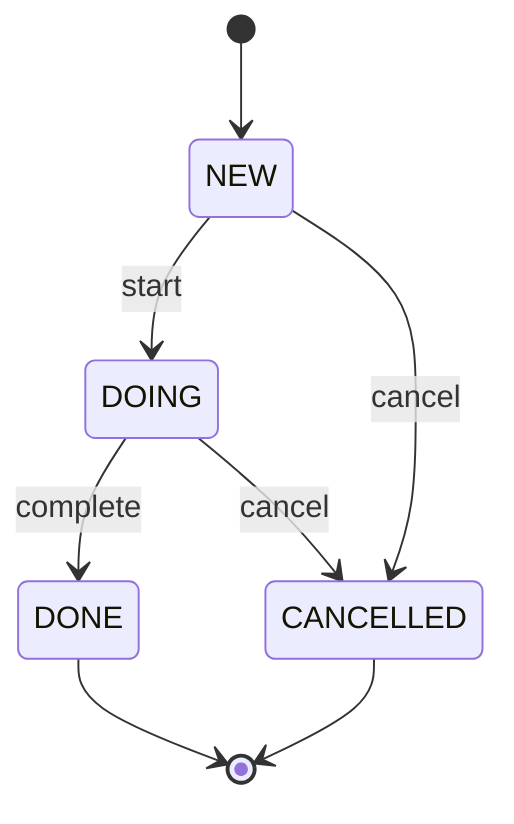

# 問題 — tramli basics

## やること

todo に `state` 列を追加し、**不正遷移を弾く** ロジックを **tramli の流儀で** 書く(ライブラリは入れない、考え方を真似る)。

## state machine の仕様



- 初期: `NEW`
- 終端: `DONE`, `CANCELLED`
- 表に無い遷移は **400 invalid transition** で拒否

## API 変更

`PUT /todos/{id}` の body に `action` を追加:

```json
{ "action": "start" }      // NEW → DOING
{ "action": "complete" }   // DOING → DONE
{ "action": "cancel" }     // NEW or DOING → CANCELLED
```

`title` の更新は引き続き `{"title":"..."}` で可。`done` boolean は **削除**(state machine に置き換わる)。

GET レスポンスに `state` を含める:

```json
{"id":1,"title":"買い物","state":"NEW","createdAt":...}
```

## 設計のキモ(tramli 的アプローチ)

### 1. State を enum で(flat、階層なし)

```java
public enum TodoState {
    NEW(false, true),       // initial=true
    DOING(false, false),
    DONE(true, false),      // terminal=true
    CANCELLED(true, false);

    private final boolean terminal;
    private final boolean initial;
    TodoState(boolean t, boolean i) { terminal = t; initial = i; }
    public boolean isTerminal() { return terminal; }
    public boolean isInitial() { return initial; }
}
```

### 2. Transition 表を宣言的に書く

```java
private static final Map<String, Map<TodoState, TodoState>> TRANSITIONS = Map.of(
    "start",    Map.of(TodoState.NEW,   TodoState.DOING),
    "complete", Map.of(TodoState.DOING, TodoState.DONE),
    "cancel",   Map.of(TodoState.NEW,   TodoState.CANCELLED,
                       TodoState.DOING, TodoState.CANCELLED)
);
```

### 3. 遷移は **表だけ見て判断**

```java
TodoState next = TRANSITIONS.get(action).get(currentState);
if (next == null) throw new IllegalArgumentException("invalid transition: " + action + " from " + currentState);
```

`switch` で `if-else if-else` を**書かない**。表に集約する。

### 4. terminal からは絶対遷移しない

```java
if (currentState.isTerminal()) throw new IllegalArgumentException("already terminal");
```

## ヒント

- `Todo.java` に `state` フィールド追加(初期値 `NEW`)
- `TodoStore` に `transition(tenant, user, id, action)` メソッド追加
- `TodoServlet` の PUT で `action` を読み、`transition` を呼ぶ
- `done` boolean は削除(`state == DONE` で判定する側に変える)

## 検証

```bash
# create
curl -s -d '{"title":"買い物"}' -H "Content-Type: application/json" \
     http://localhost:7743/todos
# → {"id":1,"title":"買い物","state":"NEW","createdAt":...}

# NEW → DOING
curl -s -X PUT -d '{"action":"start"}' -H "Content-Type: application/json" \
     http://localhost:7743/todos/1
# → {"id":1,"title":"買い物","state":"DOING",...}

# DOING → DONE
curl -s -X PUT -d '{"action":"complete"}' -H "Content-Type: application/json" \
     http://localhost:7743/todos/1
# → {"id":1,"title":"買い物","state":"DONE",...}

# DONE からは何もできない
curl -s -X PUT -d '{"action":"start"}' -H "Content-Type: application/json" \
     http://localhost:7743/todos/1
# → 400 invalid transition

# NEW から DONE はできない(skip 不可)
curl -s -d '{"title":"スキップ試行"}' -H "Content-Type: application/json" \
     http://localhost:7743/todos                    # → id=2 (NEW)
curl -s -o /dev/null -w "%{http_code}\n" -X PUT \
     -d '{"action":"complete"}' -H "Content-Type: application/json" \
     http://localhost:7743/todos/2
# → 400 invalid transition
```

書けたら [答え](../答え/) へ。
