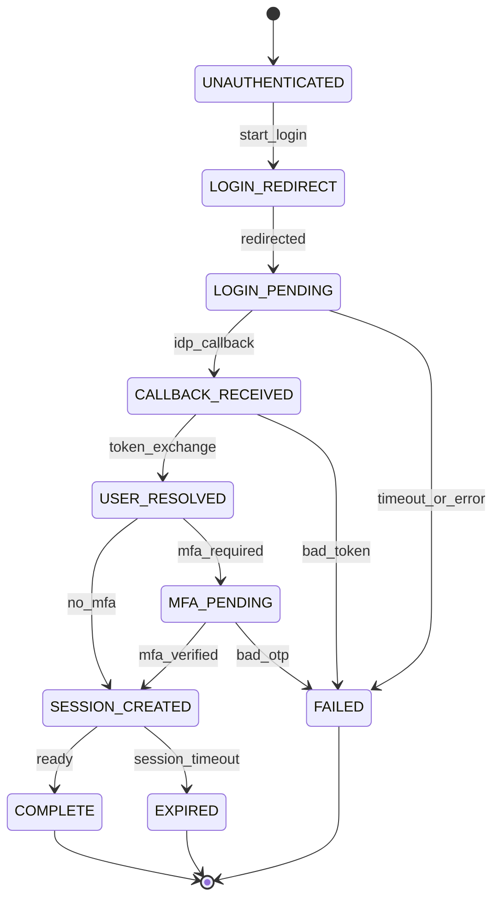
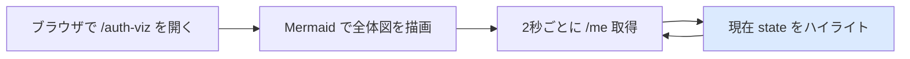

# 05 — auth-viz: tramli で auth flow を可視化

## 対話

> **後輩**「lesson 04 で tramli 思想を todo に使いました。次は auth でこれをやるんですよね?」

> **先輩**「そう。volta-auth-proxy の auth flow は **9つの状態** と数本の遷移で出来てる。これを `FlowDefinition` 風に書いて、Mermaid で出して、現在状態(`/me` から取る)を **ハイライト**する。」

> **後輩**「それが volta-auth-console の `/monitor` ページがやりたい事ですよね?」

> **先輩**「縮小版。本物は WebSocket 経由でリアルタイム遷移を流す。今回は **静的 + ポーリング** で似た体験を作る。」

## auth flow のおさらい

volta-auth-console の `authFlowDefinition`(README より)を再掲:

```
UNAUTHENTICATED → LOGIN_REDIRECT → LOGIN_PENDING
  → CALLBACK_RECEIVED → USER_RESOLVED
  → [SESSION_CREATED | MFA_PENDING] → SESSION_CREATED
  → COMPLETE
  → FAILED / EXPIRED (terminal errors)
```



これが volta の Java 側 `AuthState` が表現してるもの。todo-sample にとっては **完全に外部** の話だが、`/me` の結果から「自分が今どの状態にいるか」を導出できる。

## 状態の導出ルール

`/me` の応答から auth state を推定:

| `/me` レスポンス | 推定 auth state |
|---|---|
| `authenticated: false`(ヘッダ無し) | `UNAUTHENTICATED` |
| `authenticated: true` + role なし | `USER_RESOLVED`(MFA 完了前) |
| `authenticated: true` + role あり | `COMPLETE` |

> **後輩**「`LOGIN_REDIRECT` とか `CALLBACK_RECEIVED` は?」

> **先輩**「あれは proxy 内部で起きる。downstream の todo-sample からは見えない。**見える範囲だけ可視化** する。残りは「proxy がやってる」とラベル化する。」

## 課題

[問題](問題/) で:
1. **auth flow を tramli 流の `Map` で宣言** — `FlowDefinition` 風
2. その `Map` から **Mermaid を生成** する関数を書く
3. todo-sample に `/auth-viz` HTML ページを生やし、現在状態をハイライト
4. ページは `/me` を 2秒間隔でポーリングして表示更新

## 答え合わせ

[答え](答え/) で答え合わせ。HTML/JS まで含めた完成版。

## 完成イメージ



ヘッダ無しでアクセスすれば `UNAUTHENTICATED` がハイライトされ、`X-Volta-User-Id` 付きで叩けば `COMPLETE` がハイライトされる(curl の場合は擬似的に)。
