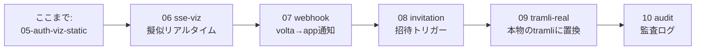

# 99 — Roadmap: 次の章

ここまでで認証・テナント・認可・状態機械・可視化の **基礎** が身についた。次にやれるネタ。

## 拡張テーマ

## 06 sse-viz — Server-Sent Events で擬似リアルタイム

**狙い**: lesson 05 はクライアント側ポーリング。SSE で **サーバ駆動** に変える。

- `GET /auth-stream` を SSE エンドポイントにする
- サーバ側で `/me` の状態が変わったタイミング(認証ヘッダの有無等)で event 送信
- フロントは `EventSource` で購読、`tick()` のポーリングを廃止

**学べること**: Server-Sent Events、イベント駆動 UI、Servlet のコネクション保持

**完成形**: 認証完了の瞬間に `UNAUTHENTICATED → COMPLETE` がアニメーションで切り替わる。

## 07 webhook — volta から todo-sample への通知

**狙い**: proxy → app の **逆方向** 統合。

- `POST /webhooks/volta` を生やし、HMAC 検証 + イベント受け取り
- 受けるイベント例:
  - `user.suspended` → そのユーザの todo を全部 `state=CANCELLED` に
  - `tenant.deleted` → そのテナントの todo を全部削除
  - `member.added` → 歓迎 todo を自動作成

**学べること**: HMAC 検証、idempotency、proxy→app の通知パターン

**前提**: volta-auth-proxy 側に Webhook 配信機能があること(README.md `/webhooks` ページに記述あり)。

## 08 invitation — 招待フロー

**狙い**: ユーザ自身が他人を招待できる UI。

- todo-sample の UI に「招待」ボタン
- volta の invite API を todo-sample 経由で叩く(`POST /api/v1/invitations`)
- API トークンの管理(volta から service token 取得)
- 受け入れリンクは volta が生成、メールも volta が送信

**学べること**: backend-to-backend API、service token、Tenant scoping

**難所**: service token の取得方法。ForwardAuth で渡ってくるのは user token なので、別経路で management token を持つ必要がある。

## 09 tramli-real — 本物の tramli に置き換える

**狙い**: lesson 04/05 で書いた **真似** を本物の tramli ライブラリに置き換える。

- `@unlaxer/tramli` (Java) を依存に追加
- `TodoFlow` を `FlowDefinition<TodoState>` に置換
- `requires/produces` でデータ依存を表現
- `build()` で 8項目検証を発動
- `toMermaid()` を tramli の組み込み機能に切り替え

**学べること**: 本格的な制約付き state machine、annotation processor、build-time 検証

**前提**: tramli の Java artifact 公開状況(README 確認)。

## 10 audit — 監査ログ

**狙い**: 「誰が何をいつ」を記録し、tenant 内の admin が見られるようにする。

- すべての変更操作を `audit` table に書く(in-memory or SQLite)
- `GET /audit` を ADMIN/OWNER のみ閲覧可
- 変更前後の diff を記録

**学べること**: 監査ログの基本パターン、PII の扱い、tenant スコープでの可視化

## blocked: 本物の tramli-viz

`@unlaxer/tramli-viz` が npm 公開され、`volta-auth-proxy` の `/viz/ws` が実装されたら、lesson 05 を **WebSocket 駆動の本物 viz** に置換できる。

ブロッカー:
- [tramli#37](https://github.com/opaopa6969/tramli/issues/37) — tramli-viz npm 公開
- [volta-auth-proxy#22](https://github.com/opaopa6969/volta-auth-proxy/issues/22) — `/viz/ws` 実装

## 着手順の推奨

1. **06 (SSE)** — UI の体感が劇的に向上する。やる気維持に効く
2. **09 (tramli-real)** — 04/05 で書いた真似を本物にする(tramli artifact 次第)
3. **07 (webhook)** — volta との双方向統合の本番デモ
4. **10 (audit)** — 業務アプリらしさが出る
5. **08 (invitation)** — service token 取得の設計が必要、最後でも可

## 完了したら

PR を投げるなり fork するなり、好きに使って。基礎ハンズオンとしては 00 → 05 で一通り終わる。
