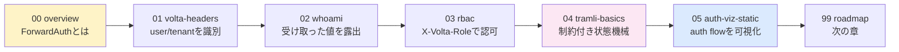

# todo-sample hands-on

[volta-auth-proxy](https://github.com/opaopa6969/volta-auth-proxy) を todo-sample に組み込みながら、認証・テナント・認可・可視化の基礎を身につける。

各 lesson は **対話 → 概念 → 課題 → 答え合わせ** の順。1課題は 5〜15分で終わるサイズ。

## 学習路線



**tramli** = volta-auth-proxy が auth flow の定義に使ってる「制約付き state machine ライブラリ」。lesson 04 で **todo の状態遷移**を題材に基礎を学び、lesson 05 で **auth flow** に応用する。

## 進め方

1. 各 lesson の `README.md` を読む(対話で導入 → 課題)
2. `問題/` の指示に従って **自分の手で** todo-sample 本体を編集
3. 動かして確認
4. `答え/` で答え合わせ + 設計の意図を読む

## 前提

- todo-sample がローカルで動くこと(`mvn jetty:run` → http://localhost:7743/)
- `curl` が使えること
- 認証なしで `(tenant=public, user=anonymous)` バケットに書き込めることを確認済み

確認:

```bash
curl -s http://localhost:7743/todos                 # → []
curl -s -d '{"title":"hello"}' -H "Content-Type: application/json" \
     http://localhost:7743/todos                    # → {"id":1,...}
```

## ルール

- **答えを先に見ない**。詰まったら 問題/ のヒントを読む
- volta-auth-proxy 本体は **動かさなくていい**。`curl -H "X-Volta-User-Id: alice"` で proxy のフリができる
- 各 lesson は前 lesson の状態を前提にする。順番に進めるのが楽

## 著作・ライセンス

このハンズオンは todo-sample の一部。MIT 想定(必要に応じて追加)。
